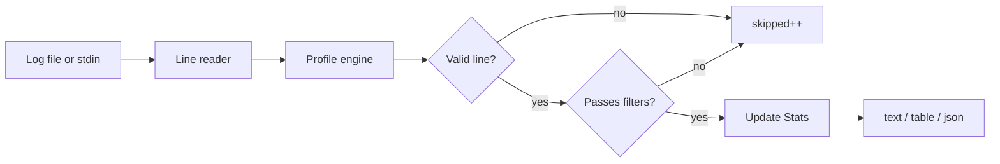

# log-analyzer

[](https://ziglang.org/)
[](LICENSE)

A fast, dependency-free CLI tool written in [Zig](https://ziglang.org/) that scans log files using **declarative layout profiles** (JSON) and prints aggregated statistics: counts per level, per module, and optional filters for time range, severity, and message content.

```text
$ log_analyzer app.log --level warn --module auth --format table

Log analysis summary
====================
Total lines:  1
Parsed:       1
Skipped:      42

Levels
------
  WARN   0
  ERROR  1

Modules
-------
  auth    1
```

---

## Features

| Capability | Description |
|------------|-------------|
| **Level counts** | Totals for `debug`, `info`, `warn`, and `error` |
| **Per-module breakdown** | How many lines each module emitted |
| **Minimum level filter** | Keep lines at or above a severity (`--level warn`) |
| **Module filter** | Restrict analysis to one module (`--module auth`) |
| **Message grep** | Substring search on the message field (`--grep "login failed"`) |
| **Time window** | Inclusive UTC bounds with `--since` / `--until` |
| **Multiple output formats** | Compact `text`, human `table`, machine `json` |
| **Stdin support** | Pipe logs in: `cat app.log \| log_analyzer` |
| **Terminal colors** | Level-colored output when stdout is a TTY (respects `NO_COLOR`) |
| **Profile-driven parsing** | Log layouts defined in JSON; bundled presets + custom profiles |
| **Auto-detect** | Picks the best matching profile from sample lines when none is specified |
| **Library module** | Core logic exposed as the `log_analyzer` Zig package |

---

## Requirements

- [Zig](https://ziglang.org/download/) **0.16.0** or newer

---

## Installation

Clone the repository and build the executable:

```bash
git clone <repository-url>
cd log-analyzer
zig build
```

The binary is installed to `zig-out/bin/log_analyzer`. Run it directly or add that directory to your `PATH`.

```bash
zig-out/bin/log_analyzer --help
```

For a one-off run without installing:

```bash
zig build run -- [options] [log-file]
```

---

## Log layout profiles

Log formats are **data, not hard-coded parsers**. Each profile is a JSON file describing how to extract timestamp, level, module, and message from a line. Bundled presets live in [`src/formats/`](src/formats/) (embedded in the binary):

| Preset id | Typical layout |
|-----------|----------------|
| `iso-structured` | `2026-05-15T20:00:01Z INFO auth login ok` |
| `level-colon-suffix` | `2026-05-03 18:29:23,784 WARNING: message [in /path/file.py:42]` |
| `bracket-timestamp-quoted-request` | Apache combined: host, `[17/May/2026:00:56:41 +0000]`, `"GET / HTTP/1.1"`, status |

When your logger uses a different timestamp or field order, **copy a preset JSON**, adjust `timestamp.pattern` and the `extract` chain, and pass it with `--format-file`. No rebuild required.

### Choosing a profile

```bash
# Auto-detect from the first few lines (default)
log_analyzer sample.log --format table

# Force a bundled preset
log_analyzer sample.log --log-format bracket-timestamp-quoted-request

# Use a custom profile
log_analyzer sample.log --format-file ./profiles/my-format.json
```

Set `LOG_ANALYZER_DEBUG=1` to print the detected profile id to stderr.

### Format profile JSON reference

A profile is a single JSON object. The analyzer reads it in order: **leading `skip_tokens` → `timestamp` → remaining `extract` steps → `level` mapping**. Every successfully parsed line becomes a `LogEntry` with a canonical timestamp (`YYYY-MM-DDTHH:MM:SSZ`), a severity, a module string (used for `--module` and per-module stats), and a message string (used for `--grep`).

#### Top-level fields

| Field | Required | Description |
|-------|----------|-------------|
| `id` | yes | Unique preset name (e.g. `iso-structured`). Used by `--log-format` and auto-detect tie-breaking. |
| `description` | no | Human-readable note; not used at runtime. |
| `timestamp` | yes | How to find and parse the timestamp (see below). |
| `extract` | yes | Ordered list of field extractors (see below). |
| `level` | yes | How to map an extracted field to `debug` / `info` / `warn` / `error`. |

Minimal profile:

```json
{
  "id": "my-format",
  "description": "Optional note",
  "timestamp": { "at": "start", "pattern": "%Y-%m-%dT%H:%M:%SZ" },
  "extract": [
    { "field": "level", "type": "token" },
    { "field": "module", "type": "token" },
    { "field": "message", "type": "rest" }
  ],
  "level": { "field": "level" }
}
```

#### `timestamp`

| Field | Values | Description |
|-------|--------|-------------|
| `at` | `"start"` | Match `pattern` at the current cursor (after any leading `skip_tokens`). |
| `at` | `"regex"` | Find the first `[...]` segment in the line and parse the inner text with `pattern`. |
| `pattern` | string | strftime-like pattern; literal characters must match exactly. |

Supported specifiers:

| Specifier | Matches | Example |
|-----------|---------|---------|
| `%Y` | 4-digit year | `2026` |
| `%m` | 2-digit month | `05` |
| `%d` | 2-digit day | `17` |
| `%H` | 2-digit hour (24h) | `14` |
| `%M` | 2-digit minute | `30` |
| `%S` | 2-digit second | `45` |
| `%3f` | 3-digit milliseconds | `784` |
| `%b` | 3-letter month name | `May` |
| `%z` | `Z` or `+0000` / `-0500` | `Z`, `+0000` |

Examples:

```json
"timestamp": { "at": "start", "pattern": "%Y-%m-%dT%H:%M:%SZ" }
"timestamp": { "at": "start", "pattern": "%Y-%m-%d %H:%M:%S,%3f" }
"timestamp": { "at": "start", "pattern": "[%d/%b/%Y:%H:%M:%S %z]" }
```

Parsed timestamps are always stored as `YYYY-MM-DDTHH:MM:SSZ` (seconds precision; milliseconds are read but not kept). That keeps `--since` and `--until` working with ISO UTC strings on the CLI.

#### `extract`

Each element describes one extraction step. Steps run left-to-right on the line. Use field names `level`, `module`, and `message` when you want standard filters and stats; any other name (e.g. `_host`) is parsed but only used if referenced by `level.field`.

**Processing order:** All consecutive `skip_tokens` steps at the **beginning** of the array run first, then `timestamp`, then every remaining step in array order.

| `type` | Extra fields | Behavior |
|--------|--------------|----------|
| `skip_tokens` | `count` (number) | Skip N space-separated tokens (e.g. client IP, `-`, `-`). Only the leading run is applied before the timestamp. |
| `token` | `separator` (optional string) | Read the next space-delimited token; strip `separator` from the end (e.g. `":"` turns `WARNING:` into `WARNING`). |
| `until` | `literal` (string) | Read text until `literal`; if `literal` is missing, use the rest of the line. |
| `rest` | — | Trim and take everything left on the line. |
| `quoted` | — | Read a double-quoted string (`"..."`), including spaces inside quotes. |
| `regex_suffix` | `pattern`, `group` | Extract module from a trailing `[in path:line]` suffix (see bundled `level-colon-suffix` preset). |

Optional fields on any step:

| Field | Values | Description |
|-------|--------|-------------|
| `transform` | `none` (default), `basename`, `basename_strip_ext` | Post-process the extracted value (path → filename). |
| `strip_ext` | string | With `basename_strip_ext`, remove this suffix (e.g. `".py"`). |

If `module` is never set, the engine uses the `status` field as the module when present (useful for HTTP access logs).

#### `level`

| Field | Description |
|-------|-------------|
| `field` | Name of the extracted field that holds the level token or numeric code. |

Then **either** map text with `aliases` **or** map numbers with `derive` (not both required; aliases are tried first when present).

**`aliases`** — array of `{ "from", "to" }` pairs. `from` is matched case-insensitively; `to` must be `debug`, `info`, `warn`, or `error`.

```json
"level": {
  "field": "level",
  "aliases": [
    { "from": "WARNING", "to": "warn" },
    { "from": "CRITICAL", "to": "error" }
  ]
}
```

**`derive`** — array of inclusive numeric ranges. First matching range wins. Used when `field` is a number (e.g. HTTP status).

```json
"level": {
  "field": "status",
  "derive": [
    { "min": 100, "max": 399, "level": "info" },
    { "min": 400, "max": 499, "level": "warn" },
    { "min": 500, "max": 599, "level": "error" }
  ]
}
```

If the level cannot be resolved, the line is skipped.

#### Full examples

See the bundled presets for copy-paste starting points:

- [`src/formats/iso-structured.json`](src/formats/iso-structured.json) — space-separated ISO line
- [`src/formats/level-colon-suffix.json`](src/formats/level-colon-suffix.json) — `LEVEL:` separator, `until` message, `regex_suffix` module, aliases
- [`src/formats/bracket-timestamp-quoted-request.json`](src/formats/bracket-timestamp-quoted-request.json) — `skip_tokens`, bracketed timestamp, `quoted` request, status `derive`

Malformed lines are skipped. In `text` output mode, a warning is printed when any lines were skipped.

---

## Quick start

Analyze a file with the default compact output:

```bash
log_analyzer test/fixtures/sample.log
```

```text
Stats{ total=4, info=1, warn=1, error_count=1, debug=1, per_module={auth=3, db=1} }
```

Pipe from stdin (omit the file argument):

```bash
cat test/fixtures/sample.log | log_analyzer
```

Show a formatted summary table:

```bash
log_analyzer test/fixtures/sample.log --format table
```

Emit JSON for scripting:

```bash
log_analyzer test/fixtures/sample.log --format json | jq .
```

---

## Filtering

Filters combine with **AND** logic: a line must pass every active filter to be counted.

### Minimum level

Only include lines at or above the given severity (rank: debug < info < warn < error):

```bash
log_analyzer app.log --level warn
log_analyzer app.log --level=error
log_analyzer app.log -l debug
```

### Module

Only count lines from a specific module:

```bash
log_analyzer app.log --module auth
log_analyzer app.log -m db
```

### Message grep

Keep lines whose **message** contains the pattern as a literal substring (not a regular expression):

```bash
log_analyzer app.log --grep "login failed"
log_analyzer app.log --grep=invalid
```

### Time range

Bounds are inclusive. Timestamps use the same ISO 8601 UTC format as log lines and compare as byte strings (valid for this fixed-width format):

```bash
log_analyzer app.log --since 2026-05-15T20:00:02Z
log_analyzer app.log --until=2026-05-15T20:00:03Z
log_analyzer app.log --since 2026-05-15T20:00:01Z --until 2026-05-15T20:00:03Z
```

### Combined example

Investigate auth errors mentioning invalid credentials during an incident window:

```bash
log_analyzer production.log \
  --module auth \
  --level error \
  --grep "invalid credentials" \
  --since 2026-05-15T20:00:00Z \
  --until 2026-05-15T21:00:00Z \
  --format table
```

---

## Output formats

### `text` (default)

Single-line struct dump, with ANSI colors on TTYs:

```text
Stats{ total=4, info=1, warn=1, error_count=1, debug=1, per_module={auth=3, db=1} }
```

### `table`

Human-readable summary with parsed/skipped counts, level breakdown, and aligned module table:

```text
Log analysis summary
====================
Total lines:  4
Parsed:       4
Skipped:      1

Levels
------
  DEBUG  1
  INFO   1
  WARN   1
  ERROR  1

Modules
-------
  auth    3
  db      1
```

### `json`

Stable structure for CI pipelines and dashboards:

```json
{
  "total": 4,
  "info": 1,
  "warn": 1,
  "error_count": 1,
  "debug": 1,
  "per_module": {
    "auth": 3,
    "db": 1
  },
  "parsed": 4,
  "skipped": 1
}
```

---

## CLI reference

```
Usage: log_analyzer [options] [log-file]

Analyze a log file and print statistics.
Reads from stdin when log-file is omitted:
  cat app.log | log_analyzer
```

| Option | Description |
|--------|-------------|
| `-h`, `--help` | Show usage and exit |
| `-l`, `--level <LEVEL>` | Minimum level: `debug`, `info`, `warn`, `error` |
| `--level=<LEVEL>` | Same as `--level` |
| `-m`, `--module <NAME>` | Only include lines from this module |
| `--grep <PATTERN>` | Only include lines whose message contains `PATTERN` |
| `--grep=<PATTERN>` | Same as `--grep` |
| `--since <TIMESTAMP>` | Include lines at or after UTC timestamp |
| `--since=<TIMESTAMP>` | Same as `--since` |
| `--until <TIMESTAMP>` | Include lines at or before UTC timestamp |
| `--until=<TIMESTAMP>` | Same as `--until` |
| `--format <FMT>` | Output format: `text`, `table`, or `json` (default: `text`) |
| `--format=<FMT>` | Same as `--format` |
| `--log-format <ID>` | Bundled layout preset (e.g. `iso-structured`) |
| `--log-format=<ID>` | Same as `--log-format` |
| `--format-file <PATH>` | Custom layout profile JSON (overrides `--log-format`) |
| `--format-file=<PATH>` | Same as `--format-file` |
| `--format-dir <DIR>` | Extra profile directory for auto-detect |
| `--format-dir=<DIR>` | Same as `--format-dir` |
| `[log-file]` | Path to log file; reads stdin if omitted |

**Environment**

| Variable | Effect |
|----------|--------|
| `NO_COLOR` | Disable ANSI colors when set (non-empty) |
| `CLICOLOR_FORCE` | Force color when set (non-empty) |
| `LOG_ANALYZER_DEBUG` | Log detected layout profile id to stderr |

---

## How it works



1. Lines are read in streaming fashion (64 KiB buffer) — suitable for large files.
2. Each line is parsed with the selected or auto-detected JSON profile into timestamp, level, module, and message.
3. Active filters (level, module, grep, time bounds) are applied.
4. Matching lines update running counters and per-module hash map.
5. Results are formatted to stdout.

---

## Project layout

```text
log-analyzer/
├── build.zig          # Build script (executable + tests)
├── build.zig.zon      # Package manifest
├── src/
│   ├── main.zig       # CLI entry point
│   ├── cli.zig        # Argument parsing
│   ├── analyze.zig    # File/stdin scanning pipeline
│   ├── entry.zig      # LogEntry, Level, filters
│   ├── timestamp.zig  # Pattern parsing and canonical ISO keys
│   ├── parser.zig     # Compatibility re-exports
│   ├── profile/       # Schema, loader, engine, detect
│   ├── formats/       # Bundled layout presets (JSON)
│   ├── stats.zig      # Aggregation and output formatters
│   └── root.zig       # Public library exports
└── test/
    └── fixtures/
        ├── sample.log
        ├── level-colon.sample.log
        └── apache-combined.sample.log
```

The `log_analyzer` Zig module can be imported from other packages:

```zig
const log_analyzer = @import("log_analyzer");

var stats = log_analyzer.Stats.init(allocator);
defer stats.deinit();

const profile = try log_analyzer.loadPreset(allocator, "iso-structured");
defer profile.deinit(allocator);

const scan = try log_analyzer.processLogFile(
    "app.log",
    io,
    &stats,
    &profile,
    log_analyzer.Level.warn, // min level, or null
    "auth",                  // module filter, or null
    "login",                 // grep pattern, or null
    .{ .since = "2026-05-15T20:00:00Z" },
    &.{},                    // prefetched peek lines
);
_ = scan; // scan.parsed, scan.skipped
```

---

## Development

Run the full test suite (library + CLI):

```bash
zig build test
```

Run the analyzer against the sample fixture:

```bash
zig build run -- test/fixtures/sample.log --format table
```

---

## License

This project is licensed under the [MIT License](LICENSE).

Copyright © 2026 BxfferOverflow
