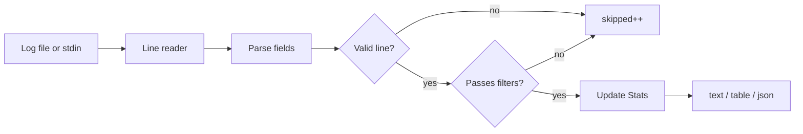

# log-analyzer

A fast, dependency-free CLI tool written in [Zig](https://ziglang.org/) that scans structured application logs and prints aggregated statistics: counts per level, per module, and optional filters for time range, severity, and message content.

```text
$ log_analyzer app.log --level warn --module auth --format table

Log analysis summary
====================
Total lines:  1
Parsed:       1
Skipped:      42

Levels
------
  WARN   0
  ERROR  1

Modules
-------
  auth    1
```

---

## Features

| Capability | Description |
|------------|-------------|
| **Level counts** | Totals for `debug`, `info`, `warn`, and `error` |
| **Per-module breakdown** | How many lines each module emitted |
| **Minimum level filter** | Keep lines at or above a severity (`--level warn`) |
| **Module filter** | Restrict analysis to one module (`--module auth`) |
| **Message grep** | Substring search on the message field (`--grep "login failed"`) |
| **Time window** | Inclusive UTC bounds with `--since` / `--until` |
| **Multiple output formats** | Compact `text`, human `table`, machine `json` |
| **Stdin support** | Pipe logs in: `cat app.log \| log_analyzer` |
| **Terminal colors** | Level-colored output when stdout is a TTY (respects `NO_COLOR`) |
| **Library module** | Core logic exposed as the `log_analyzer` Zig package |

---

## Requirements

- [Zig](https://ziglang.org/download/) **0.16.0** or newer

---

## Installation

Clone the repository and build the executable:

```bash
git clone <repository-url>
cd log-analyzer
zig build
```

The binary is installed to `zig-out/bin/log_analyzer`. Run it directly or add that directory to your `PATH`.

```bash
zig-out/bin/log_analyzer --help
```

For a one-off run without installing:

```bash
zig build run -- [options] [log-file]
```

---

## Log format

Each line must follow this space-separated layout:

```text
<TIMESTAMP> <LEVEL> <MODULE> <MESSAGE...>
```

| Field | Format | Example |
|-------|--------|---------|
| Timestamp | ISO 8601 UTC, `YYYY-MM-DDTHH:MM:SSZ` | `2026-05-15T20:00:01Z` |
| Level | `debug`, `info`, `warn`, or `error` (case-insensitive) | `INFO` |
| Module | Single token, no spaces | `auth` |
| Message | Remainder of the line (may contain spaces) | `login ok` |

**Example**

```text
2026-05-15T20:00:01Z INFO auth login ok
2026-05-15T20:00:02Z WARN db connection slow
2026-05-15T20:00:03Z ERROR auth invalid credentials
```

Malformed lines are skipped and do not contribute to statistics. In `text` output mode, a warning is printed when any lines were skipped.

---

## Quick start

Analyze a file with the default compact output:

```bash
log_analyzer test/fixtures/sample.log
```

```text
Stats{ total=4, info=1, warn=1, error_count=1, debug=1, per_module={auth=3, db=1} }
```

Pipe from stdin (omit the file argument):

```bash
cat test/fixtures/sample.log | log_analyzer
```

Show a formatted summary table:

```bash
log_analyzer test/fixtures/sample.log --format table
```

Emit JSON for scripting:

```bash
log_analyzer test/fixtures/sample.log --format json | jq .
```

---

## Filtering

Filters combine with **AND** logic: a line must pass every active filter to be counted.

### Minimum level

Only include lines at or above the given severity (rank: debug < info < warn < error):

```bash
log_analyzer app.log --level warn
log_analyzer app.log --level=error
log_analyzer app.log -l debug
```

### Module

Only count lines from a specific module:

```bash
log_analyzer app.log --module auth
log_analyzer app.log -m db
```

### Message grep

Keep lines whose **message** contains the pattern as a literal substring (not a regular expression):

```bash
log_analyzer app.log --grep "login failed"
log_analyzer app.log --grep=invalid
```

### Time range

Bounds are inclusive. Timestamps use the same ISO 8601 UTC format as log lines and compare as byte strings (valid for this fixed-width format):

```bash
log_analyzer app.log --since 2026-05-15T20:00:02Z
log_analyzer app.log --until=2026-05-15T20:00:03Z
log_analyzer app.log --since 2026-05-15T20:00:01Z --until 2026-05-15T20:00:03Z
```

### Combined example

Investigate auth errors mentioning invalid credentials during an incident window:

```bash
log_analyzer production.log \
  --module auth \
  --level error \
  --grep "invalid credentials" \
  --since 2026-05-15T20:00:00Z \
  --until 2026-05-15T21:00:00Z \
  --format table
```

---

## Output formats

### `text` (default)

Single-line struct dump, with ANSI colors on TTYs:

```text
Stats{ total=4, info=1, warn=1, error_count=1, debug=1, per_module={auth=3, db=1} }
```

### `table`

Human-readable summary with parsed/skipped counts, level breakdown, and aligned module table:

```text
Log analysis summary
====================
Total lines:  4
Parsed:       4
Skipped:      1

Levels
------
  DEBUG  1
  INFO   1
  WARN   1
  ERROR  1

Modules
-------
  auth    3
  db      1
```

### `json`

Stable structure for CI pipelines and dashboards:

```json
{
  "total": 4,
  "info": 1,
  "warn": 1,
  "error_count": 1,
  "debug": 1,
  "per_module": {
    "auth": 3,
    "db": 1
  },
  "parsed": 4,
  "skipped": 1
}
```

---

## CLI reference

```
Usage: log_analyzer [options] [log-file]

Analyze a log file and print statistics.
Reads from stdin when log-file is omitted:
  cat app.log | log_analyzer
```

| Option | Description |
|--------|-------------|
| `-h`, `--help` | Show usage and exit |
| `-l`, `--level <LEVEL>` | Minimum level: `debug`, `info`, `warn`, `error` |
| `--level=<LEVEL>` | Same as `--level` |
| `-m`, `--module <NAME>` | Only include lines from this module |
| `--grep <PATTERN>` | Only include lines whose message contains `PATTERN` |
| `--grep=<PATTERN>` | Same as `--grep` |
| `--since <TIMESTAMP>` | Include lines at or after UTC timestamp |
| `--since=<TIMESTAMP>` | Same as `--since` |
| `--until <TIMESTAMP>` | Include lines at or before UTC timestamp |
| `--until=<TIMESTAMP>` | Same as `--until` |
| `--format <FMT>` | `text`, `table`, or `json` (default: `text`) |
| `--format=<FMT>` | Same as `--format` |
| `[log-file]` | Path to log file; reads stdin if omitted |

**Environment**

| Variable | Effect |
|----------|--------|
| `NO_COLOR` | Disable ANSI colors when set (non-empty) |
| `CLICOLOR_FORCE` | Force color when set (non-empty) |

---

## How it works



1. Lines are read in streaming fashion (64 KiB buffer) — suitable for large files.
2. Each line is parsed into timestamp, level, module, and message.
3. Active filters (level, module, grep, time bounds) are applied.
4. Matching lines update running counters and per-module hash map.
5. Results are formatted to stdout.

---

## Project layout

```text
log-analyzer/
├── build.zig          # Build script (executable + tests)
├── build.zig.zon      # Package manifest
├── src/
│   ├── main.zig       # CLI entry point
│   ├── cli.zig        # Argument parsing
│   ├── analyze.zig    # File/stdin scanning pipeline
│   ├── parser.zig     # Log line parser and filters
│   ├── stats.zig      # Aggregation and output formatters
│   └── root.zig       # Public library exports
└── test/
    └── fixtures/
        └── sample.log # Example log for manual testing
```

The `log_analyzer` Zig module can be imported from other packages:

```zig
const log_analyzer = @import("log_analyzer");

var stats = log_analyzer.Stats.init(allocator);
defer stats.deinit();

const scan = try log_analyzer.processLogFile(
    "app.log",
    io,
    &stats,
    log_analyzer.Level.warn, // min level, or null
    "auth",                  // module filter, or null
    "login",                 // grep pattern, or null
    .{ .since = "2026-05-15T20:00:00Z" },
);
_ = scan; // scan.parsed, scan.skipped
```

---

## Development

Run the full test suite (library + CLI):

```bash
zig build test
```

Run the analyzer against the sample fixture:

```bash
zig build run -- test/fixtures/sample.log --format table
```

---

## License

No license file is included yet. Add one before distributing or publishing the package.
